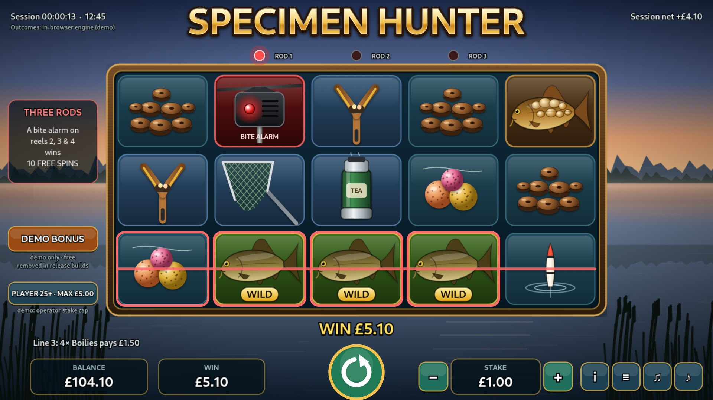
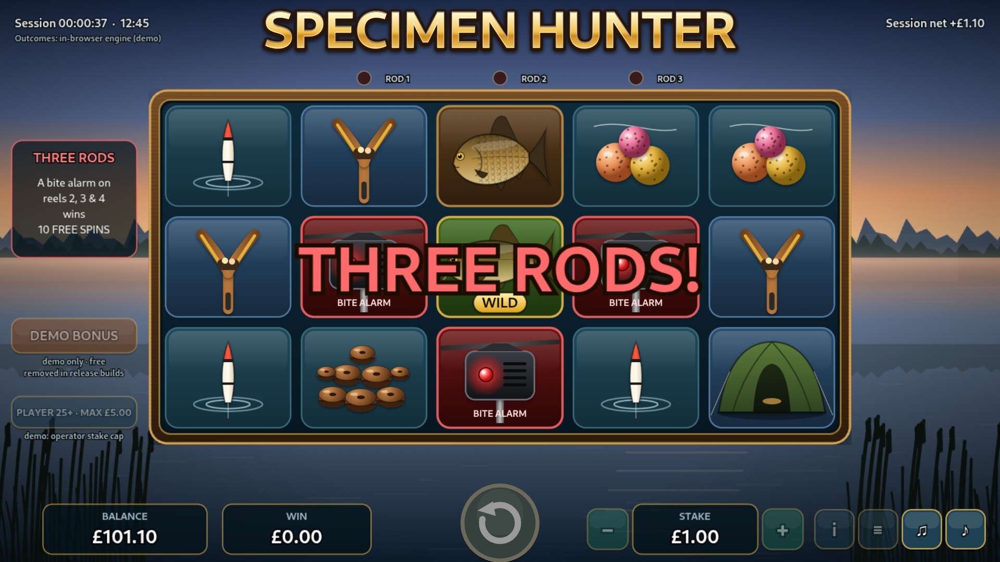
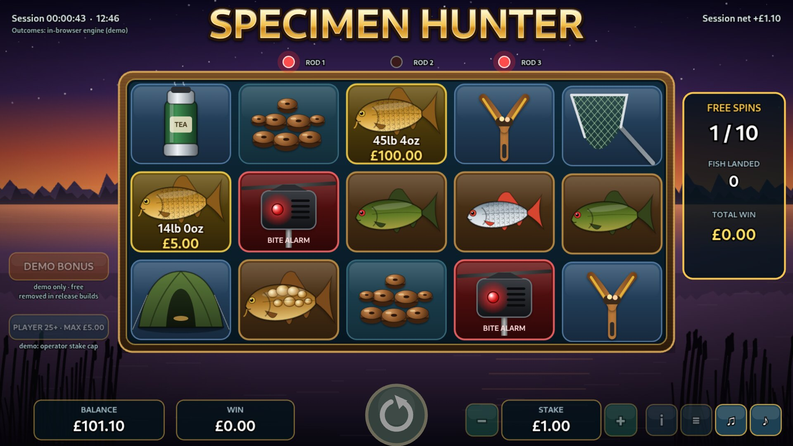
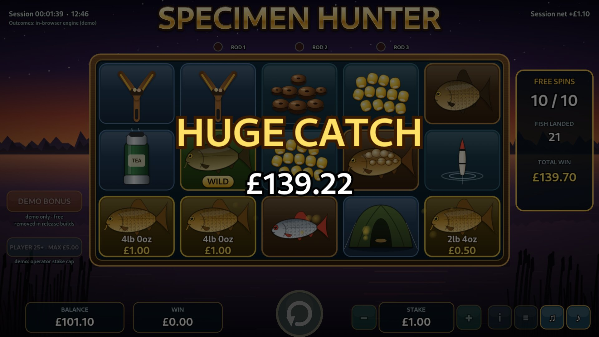

# 🎣 Specimen Hunter

**An original British carp-fishing slot built around one moment every angler lives for: three bite alarms going off at once.**

### [▶ Play the demo](https://charliehall10.github.io/specimen-hunter/play/) · [🎬 Watch the gameplay video](https://charliehall10.github.io/specimen-hunter/media/specimen-hunter-gameplay.mp4) · [📄 Case study](https://charliehall10.github.io/specimen-hunter/)

---

## The hook: Three Rods

Carp anglers fish three rods at once, each on an electronic bite alarm. When all three scream together, that's the best day of the year.

In Specimen Hunter, **a bite alarm on each of reels 2, 3 and 4 triggers the Three Rods free spins**. The rod lights come on one by one as the alarms land, and with two lit the last reels hold back under a red glow.

## Every fish is weighed

In free spins, **Specimen Fish** land with real carp weights and **pay the moment they land**, with no collector symbol needed. Weights run from a 2lb 4oz tiddler (0.5× stake) up to two record fish: **52lb 0oz (250×)** and **64lb 8oz (1,000×)**.

| | |
|---|---|
|  |  |

## The numbers

| | |
|---|---|
| **Theoretical RTP** | **96.14%**, worked out exactly from the reel strips |
| Free spins trigger | 1 in 152 spins |
| Average free spins win | 63.7× stake |
| Base-game hit rate | 25.5% |
| Volatility | 7.2 (standard deviation, × stake) |
| Maximum win | 5,000× per round (cap) |
| Layout | 5 reels × 3 rows, 10 fixed lines |
| Stakes | 10p to £5 (£2 maximum for players aged 18 to 24) |

Backed by a full **PAR sheet**: exact strip maths, cross-checked against a 50-million-round simulation of the game engine (simulated RTP 96.06% ± 0.20%).

## Built for UK rules from day one

- **Stake limits:** £5 per spin, or £2 for 18 to 24-year-olds, set from the casino's player settings
- **At least 2.5 seconds per spin**, with no turbo, quick stop, slam stop or autoplay
- **Small returns aren't dressed up as wins:** anything at or below the stake is shown plainly, with no fanfare
- **No bonus buy**
- **Player information on screen:** session time, net position, game history and a reality check every 30 minutes

## Under the hood

- **One engine, two places.** The same tested maths engine decides outcomes in the browser demo and on a dependency-free game server. The server handles sessions, stake limits, a whole-pence wallet and safe retries, so a dropped connection can never charge a player twice.
- **100% original assets.** Every symbol, the lakeside scenery, the music and the sound effects are generated in code (PixiJS 8 and Web Audio). There are no licensed art or audio files.
- **Tested.** 15 automated tests cover the maths, wallet, stake limits and API, and the PAR sheet matches the engine with zero difference.
- **Runs anywhere:** in a browser, on a phone in landscape, or as a desktop app.

## About this repository

This repository hosts the **public demo site** only: the landing page, the playable demo (`play/`) and media. The full source code, maths simulator and PAR sheet are private and available to studios on request.

## Status and contact

Specimen Hunter is a **demo**: it uses demo money and a secure but **uncertified** random number generator, so it is not for real-money play. The next steps toward launch (test-house certification, trade mark clearance and integration with a casino platform) are typically handled with a licensed studio or aggregator.

**I'm looking for** a licensed studio or aggregator partner to take Specimen Hunter to market, or a role in slot game design, maths or front-end development.

**Charlie Hall** · [LinkedIn](https://www.linkedin.com/in/charliehall20)

---

Demo money only · 18+ · Not certified for real-money play · If gambling stops being fun, visit [BeGambleAware.org](https://www.begambleaware.org/)
